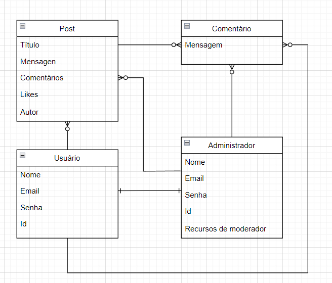

# SceneMe

Projeto Final do Curso Técnico Integrado de Desenvolvimento de Sistemas - Colégio Pedro II - Campus Duque de Caxias

**Integrantes:**
 - Felipe Marques
 - Rafael Dávila
 - Carlos Willian

## Descrição do Projeto

O projeto SceneMe é um site feito para amantes de filmes como nós! 
O lugar perfeito para debater sobre os seus filmes favoritos, descobrir 
novos gostos, fazer novos amigos que compartilham os seus interesses e
gostos e testar sua sabedoria de cada filme.

A principal proposta do SceneMe é criar um ambiente que receba de braços abertos
fãs de cinematografia, onde os usuários podem compartilhar suas opinões, debates, conversas
sobre os seus tópicos de seus gêneros de filme e titulos fávoritos.

O que você está esperando? Venha se juntar a nós na comunidade do SceneMe! 

## Informações de Moderador para testes
Nome: AfonsoFonseca

Senha: Pernambuco123

Email: afonseca@gmail.com

Data de nascimento: 23/03/2001

# Versões dos softwares
## PHP: 8.0.13 | MySQL: 10.4.22 | Apache: 2.4.51 | PhpMyAdmin: 5.1.1

## Documentação

- [Manual do Usuário](manual.md)
- [Requisitos](requisitos.md)
- [Casos de Uso](casos-de-uso.md)
- [Apresentação](apresentação.pdf)

**Modelagem do Banco de Dados**

