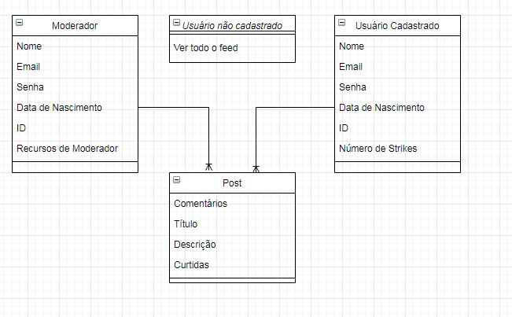

# SceneMe

Projeto Final do Curso Técnico Integrado de Desenvolvimento de Sistemas - Colégio Pedro II - Campus Duque de Caxias

**Integrantes:**
 - Felipe Marques Brandão
 - Rafael
 - Carlos Willian

## Descrição do Projeto

Nosso projeto...

## Documentação

- [Manual do Usuário](manual.md)
- [Requisitos](requisitos.md)
- [Casos de Uso](casos-de-uso.md)
- [Apresentação](apresentacao.pdf)

**Diagrama de Classes**

**Modelagem do Banco de Dados**

