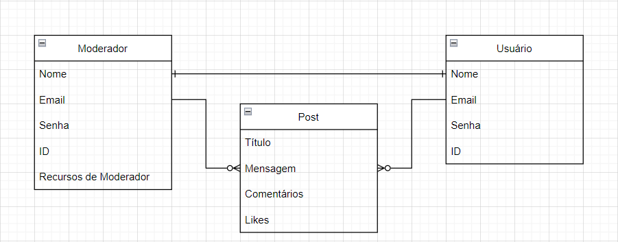

# SceneMe

Projeto Final do Curso Técnico Integrado de Desenvolvimento de Sistemas - Colégio Pedro II - Campus Duque de Caxias

**Integrantes:**
 - Felipe Marques Brandão
 - Rafael
 - Carlos Willian

## Descrição do Projeto

O projeto SceneMe é um site feito para amantes de filmes como nós! 
O lugar perfeito para debater sobre os seus filmes favoritos, encontrar pessoas 
com gostos similares aos seus e testar sua sabedoria de cada filme.
O que você esta esperando? Venha se juntar a nós no SceneMe! 

## Documentação

- [Manual do Usuário](manual.md)
- [Requisitos](requisitos.md)
- [Casos de Uso](casos-de-uso.md)
- [Apresentação](apresentacao.pdf)

**Diagrama de Classes**

**Modelagem do Banco de Dados**

