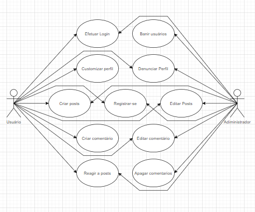

# Documento de Casos de Uso

## Lista dos Casos de Uso

 - [CDU 01](#CDU-01): Registrar-se.
 - [CDU 02](#CDU-02): Criar Posts.
 - [CDU 03](#CDU-03): Editar Posts.
 - [CDU 04](#CDU-04): Efetuar Login.
 - [CDU 05](#CDU-05): Customizar Perfil.
 - [CDU 06](#CDU-06): Criar Comentários.
 - [CDU 07](#CDU-07): Reagir a posts.
 - [CDU 08](#CDU-08): Banir usuários.
 - [CDU 09](#CDU-09): Denunciar Perfil.
 - [CDU 10](#CDU-10): Editar comentário.
 - [CDU 11](#CDU-11): Apagar comentários.

## Lista dos Atores

 - Usuário
 - Adiministrador

## Diagrama de Casos de Uso

## Descrição dos Casos de Uso

### CDU 01

Registrar-se

**Fluxo Principal**

1. O sistema apresenta um formulário de cadastro com os campos onde o usuário deve preencher.
2. O usuário insere nick, email, senha e data de nascimento.
3. O usuário clica no botão “cadastrar”.
4. O sistema armazena o usuário e o informa que a operação foi realizada.
5. O sistema retorna o usuário para a página de login.

**Fluxo Alternativo A**

1. O sistema apresenta um formulário de cadastro com os campos onde o usuário deve preencher.
2. O usuário insere nick, email, senha e data de nascimento.
3. O usuário clica no botão “cadastrar”.
4. O sistema informa que já existe um usuário com o e-mail fornecido.
5. O usuário usa outro email na criação da conta.
6. O usuário clica no botão “cadastrar”.
7. O sistema armazena o usuário e o informa que a operação foi realizada.
8. O sistema retorna o usuário para a página de login.

**Fluxo Alternativo B**

1. O sistema apresenta um formulário de cadastro com os campos onde o usuário deve preencher.
2. O usuário insere nick, email, senha e data de nascimento.
3. O usuário clica no botão “cadastrar”.
4. O sistema informa que a data de nasciemento/nome/email é invalido.
5. O usuário corrige a data de nascimento/nome/email.
6. O usuário clica no botão “cadastrar”.
7. O sistema armazena o usuário e o informa que a operação foi realizada.
8. O sistema retorna o usuário para a página de login.

### CDU 02

Criar posts.

**Fluxo Principal**

### CDU 03

Editar posts

**Fluxo Principal**

### CDU 04

Efetuar Login.

**Fluxo Principal**

1. O sistema apresenta um formulário de login com os campos onde o usuário deve preencher.
2. O usuário insere o email e a senha.
3. O usuário clica no botão “entrar”.
4. O sistema reconhece uma conta com o mesmo email e senha e leva o usuário para a página principal.

**Fluxo Alternativo A**

1. O sistema apresenta um formulário de login com os campos onde o usuário deve preencher.
2. O usuário insere o email e a senha.
3. O usuário clica no botão “entrar”.
4. O sistema informa que o email/senha foi preechido incorretamente.
5. O usuário corrige o email/senha.
6. O usuário clica no botão “entrar”.
7. O sistema reconhece uma conta com o mesmo email e senha e leva o usuário para a página principal.

### CDU 05

Customizar Perfil.

**Fluxo Principal**

1. O sistema apresenta a página de perfil do usuário.
2. O usuário decide alterar suas informações pessoais.
3. O usuário clica no botão “editar”.
4. O usuário muda email/nome/senha.
5. O usuário clica no botão “alterarr”.
6. O sistema altera as informações do usuário e o informa que a operação foi realizada.

**Fluxo Alternativo A**

1. O sistema apresenta a página de perfil do usuário.
2. O usuário decide alterar suas informações pessoais.
3. O usuário clica no botão “editar”.
4. O usuário muda email/nome/senha.
5. O usuário clica no botão “alterar”.
6. O sistema informa o usuário que o email/nome/senha é invalido.
7. O usuário corrige o email/nome/senha.
8. O usuário clica no botão “alterar”.
9. O sistema altera as informações do usuário e o informa que a operação foi realizada.

### CDU 06

Criar comentários.

**Fluxo Principal**

1. O sistema apresenta um post na página principal.
2. O usuário clica na text box abaixo do post e escreve uma mensagem.
3. O usuário clica no botão “comentar”.
4. O sistema armazena a mensagem e a exibe abaixo do post.

**Fluxo Alternativo A**

1. O sistema apresenta um post na página principal.
2. O usuário clica na text box abaixo do post e escreve uma mensagem.
3. O usuário decide não criar um comentário e clica no botão “descartar comentário”.
4. O sistema apaga o esboço da mensagem.

### CDU 07

Reagir a posts.

**Fluxo Principal**

1. O sistema apresenta um post na página principal.
2. O usuário decide adicionar uma reação ao post.
3. O usuário clica no botão “like”.
4. O sistema armazena o input e exibe abaixo do post a quantidade de likes presentes no post.

**Fluxo Alternativo A**

1. O sistema apresenta um post na página principal.
2. O usuário decide adicionar uma reação ao post.
3. O usuário clica no botão “like”.
4. O sistema armazena o input e exibe abaixo do post a quantidade de likes presentes no post.
5. O usuário muda de idea e dicide remover a sua reação ao post.
6. O usuário clica no botão “like”.
7. O sistema armazena o input e exibe abaixo do post a quantidade de likes presentes no post.

### CDU 08

Banir usuários.

**Fluxo Principal**

### CDU 09

Denunciar Perfil.

**Fluxo Principal**

### CDU 010

Editar comentário.

**Fluxo Principal**

1. O sistema apresenta um post com um comentário do usuário na página principal.
2. O usuário clica no botão “editar comentario” ao lado de seu comentário.
3. O usuário altera a mensagem do comentário.
4. O usuário clica no botão “comentar”
5. O sistema armazena a nova mensagem e a exibe abaixo do post.

**Fluxo Alternativo A**

1. O sistema apresenta um post com um comentário do usuário na página principal.
2. O usuário clica no botão “editar comentario” ao lado de seu comentário.
3. O usário decide apagar o comentário e clica no botão “descartar comentário”.
4. O sistema apaga o comentário do post.

**Fluxo Alternativo B**

1. O sistema apresenta um post com um comentário do usuário na página principal.
2. O usuário clica no botão “editar comentario” ao lado de seu comentário.
3. O usário decide que não deseja fazer alterações no comentário e clica no botão “cancelar”.
4. O sistema cancela o procediemento de edição e o comentário continua o mesmo.

### CDU 011

Apagar comentários.

**Fluxo Principal**

1. O sistema apresenta um post com um comentário de um usuário na página principal.
2. O adiministrador clica no botão “Apagar comentário” ao lado do comentário.
3. O sistema apresenta um aviso de que essa operação não pode ser desfeita.
4. O adiminstrador clica no botão "sim"
5. O sistema apaga o comntário.

**Fluxo Alternativo A**

1. O sistema apresenta um post com um comentário de um usuário na página principal.
2. O adiministrador clica no botão “Apagar comentário” ao lado do comentário.
3. O sistema apresenta um aviso de que essa operação não pode ser desfeita.
4. O adiminstrador clica no botão "não"
5. O sistema cancela o procediemento de edição e o comentário continua o mesmo.
