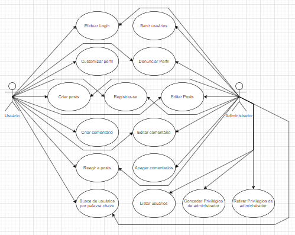

# Documento de Casos de Uso

## Lista dos Casos de Uso (notas: 3/6/10/13/14/16/17/18 precisam ser terminados)

 - [CDU 01](#CDU-01): Registrar-se.
 - [CDU 02](#CDU-02): Efetuar Login.
 - [CDU 03](#CDU-03): Efetuar Logout.
 - [CDU 04](#CDU-04): Customizar Perfil.
 - [CDU 05](#CDU-05): Listar usuários.
 - [CDU 06](#CDU-06): Editar Usuário (adm).
 - [CDU 07](#CDU-07): Exclusão de usuário (adm).
 - [CDU 08](#CDU-08): Conceder privilégios de adiministrador (adm).
 - [CDU 09](#CDU-09): Retirar privilégios de adiministrador (adm).
 - [CDU 10](#CDU-10): Busca de usuário por palavra chave.
 - [CDU 11](#CDU-11): Criar Posts.
 - [CDU 12](#CDU-12): Editar Posts.
 - [CDU 13](#CDU-13): Apagar Posts.
 - [CDU 14](#CDU-14): Exibir timeline do Usuário.
 - [CDU 15](#CDU-15): Criar Comentários.
 - [CDU 16](#CDU-16): Editar comentário.
 - [CDU 17](#CDU-17): Excluir comentário.
 - [CDU 18](#CDU-18): Exibir Comentário na timeline do Usuário.
 - [CDU 19](#CDU-19): Reagir a posts e comentários.

## Lista dos Atores

 - Usuário
 - Adiministrador

## Diagrama de Casos de Uso

## Descrição dos Casos de Uso

### CDU 01

Registrar-se

**Fluxo Principal**

1. O sistema apresenta um formulário de cadastro com os campos onde o usuário deve preencher.
2. O usuário insere nome, email, senha e data de nascimento.
3. O usuário clica no botão “cadastrar”.
4. O sistema armazena o usuário e o informa que a operação foi realizada.
5. O sistema retorna o usuário para a página de login.

**Fluxo Alternativo A**

1. O sistema apresenta um formulário de cadastro com os campos onde o usuário deve preencher.
2. O usuário insere nome, email, senha e data de nascimento.
3. O usuário clica no botão “cadastrar”.
4. O sistema informa que já existe um usuário com o e-mail fornecido.
5. O usuário usa outro email na criação da conta.
6. O usuário clica no botão “cadastrar”.
7. O sistema armazena o usuário e o informa que a operação foi realizada.
8. O sistema retorna o usuário para a página de login.

**Fluxo Alternativo B**

1. O sistema apresenta um formulário de cadastro com os campos onde o usuário deve preencher.
2. O usuário insere nome, email, senha e data de nascimento.
3. O usuário clica no botão “cadastrar”.
4. O sistema informa que a data de nasciemento/nome/email é invalido.
5. O usuário corrige a data de nascimento/nome/email.
6. O usuário clica no botão “cadastrar”.
7. O sistema armazena o usuário e o informa que a operação foi realizada.
8. O sistema retorna o usuário para a página de login.

### CDU 02

Efetuar Login.

**Fluxo Principal**

1. O sistema apresenta um formulário de login com os campos onde o usuário deve preencher.
2. O usuário insere o email e a senha.
3. O usuário clica no botão “entrar”.
4. O sistema reconhece uma conta com o mesmo email e senha e leva o usuário para a página principal.

**Fluxo Alternativo A**

1. O sistema apresenta um formulário de login com os campos onde o usuário deve preencher.
2. O usuário insere o email e a senha.
3. O usuário clica no botão “entrar”.
4. O sistema informa que o email/senha foi preechido incorretamente.
5. O usuário corrige o email/senha.
6. O usuário clica no botão “entrar”.
7. O sistema reconhece uma conta com o mesmo email e senha e leva o usuário para a página principal.

### CDU 03

Efetuar Logout.

**Fluxo Principal**

1. O sistema apresenta de perfil do usuário.
2. O usuário deciuas informações pessoais.
3. O usuário itar”.
4. O usuário insere a s muda email/nome/senha.
5. O usuário clica no botão “alterar”.
6. O sistema altera as infoo foi realizada.

**Fluxo Alternativo A**

1. O sistema apresenta a página de perfil do usuário.
2. O usuário decide alterar suas informações pessoais.

### CDU 04

Customizar Perfil.

**Fluxo Principal**

1. O sistema apresenta a página de perfil do usuário.
2. O usuário decide alterar suas informações pessoais.
3. O usuário clica no botão “editar”.
4. O usuário insere a senha antiga e muda email/nome/senha.
5. O usuário clica no botão “alterar”.
6. O sistema altera as informações do usuário e o informa que a operação foi realizada.

**Fluxo Alternativo A**

1. O sistema apresenta a página de perfil do usuário.
2. O usuário decide alterar suas informações pessoais.
3. O usuário clica no botão “editar”.
4. O usuário insere a senha antiga e muda email/nome/senha.
5. O usuário clica no botão “alterar”.
6. O sistema informa o usuário que o email/nome/senha é invalido.
7. O usuário corrige o email/nome/senha.
8. O usuário clica no botão “alterar”.
9. O sistema altera as informações do usuário e o informa que a operação foi realizada.

**Fluxo Alternativo B**

1. O sistema apresenta a página de perfil do usuário.
2. O usuário decide alterar suas informações pessoais.
3. O usuário clica no botão “editar”.
4. O usuário insere a senha antiga e muda email/nome/senha.
5. O usuário clica no botão “alterar”.
6. O sistema informa o usuário que a senha antiga foi preenchida incorretamente.
7. O usuário preenche a senha antiga corretamente.
8. O usuário clica no botão “alterar”.
9. O sistema altera as informações do usuário e o informa que a operação foi realizada.

### CDU 05

Busca de usuário por palavra chave.

**Fluxo Principal**

1. O sistema apresenta a página principal.
2. O usuário clica na barra de pesquisa e escreve um nome.
2. O usuário clica no botão “Pesquisar”.+
3. O sistema apresenta uma lista de usuários com nomes similares ao digitado.

**Fluxo Alternativo A**

1. O sistema apresenta a página principal.
2. O usuário clica na barra de pesquisa e escreve um nome.
2. O usuário clica no botão “Pesquisar”.
3. O sistema apresenta uma mensagem dizendo que não ah nenhum usuário com um nome similar ao 
digitado pelo usuário.
4. O usuário escreve outro nome na barra de pesquisa.
5. O usuário clica no botão “Pesquisar”.
6. O sistema apresenta uma lista de usuários com nomes similares ao digitado.

### CDU 06

Editar Usuário (Adm).

**Fluxo Principal**

1. O sistema apresent
2. O usuário clica na barra dee.
2. O usuário clica no b
3. O sistema apresenta umigitado.

**Fluxo Alternativo A**

1. O sistema apresenta a página principal.
2. O usuário clica na barra de .

### CDU 07

Exclusão de usuário (adm).

**Fluxo Principal**

1. O sistema apresenta a página principal.
2. O adiministrador abre a janela de adiministração.
3. O adiministrador escolhe um usuário na lista para excluir a conta.
4. O adiministrador clica no usuário e no botão “Excluir” ao lado do usuário escolhido.
5. O sistema apresenta um aviso de que essa operação não pode ser desfeita.
6. O adiiminstrador clica no botão “Ok”.
5. O sistema apaga o cadastro do usuário escolhido.

**Fluxo Alternativo A**

1. O sistema apresenta a página principal.
2. O adiministrador abre a janela de adiministração.
3. O adiministrador escolhe um usuário na lista para excluir a conta.
4. O adiministrador clica no usuário e no botão “Excluir” ao lado do usuário escolhido.
5. O sistema apresenta um aviso de que essa operação não pode ser desfeita.
6. O adiiminstrador clica no botão “Cancelar”.
5. O sistema cancela a operão de exclusão e o usuário escolhido continua com a sua conta.

### CDU 08

Conceder privilégios de adiministrador (adm).

**Fluxo Principal**

1. O sistema apresenta a página principal.
2. O adiministrador clica no botão “Admin dashboard”.
3. O sistema abre a janela de adiministração contendo a lista de todos os usuários do site.
4. O adiministrador decide conceder privilégios de adiministrador a um usuário.
5. O adiministrador clica no botão “Conceder privilégios” ao lado do usuário escolhido.
6. O sistema concede privilégios de adiministrador ao usuário escolhido.

### CDU 09

Retirar privilégios de adiministrador (adm).

**Fluxo Principal** 

1. O sistema apresenta a página principal.
2. O adiministrador clica no botão “Admin dashboard”.
3. O sistema abre a janela de adiministração contendo a lista de todos os usuários do site.
4. O adiministrador decide revogar os privilégios de adiministrador de um adiministrador.
5. O adiministrador clica no botão “Revogar privilégios” ao lado do adiministrador escolhido.
6. O sistema revoga os privilégios de adiministrador ao adiministrador escolhido.

### CDU 10

Busca de usuário por palavra chave.

**Fluxo Principal**

1. O sistema apresenta a página principal.
2. O adiministrador clica no botão “Admin dashboard”.
3. O sistema abre a janela de adiministração contendo a lista de todos os usuários do site.

### CDU 11

Criar posts.

**Fluxo Principal**

1. O sistema apresenta a página principal.
2. O usuário clica no botão “Criar post”.
3. O usuário escreve a mensagem que ele deseja passar.
4. O usuário clica no botão “Enviar”.
5. O sistema armazena a mensagem e a exibe na página principal.

**Fluxo Alternativo A**

1. O sistema apresenta a página principal.
2. O usuário clica no botão “Criar post”.
3. O usuário decide que não deseja mais criar um post.
4. O usuário clica no botão “Cancelar”.
5. O sistema apaga o esboço do post.

### CDU 12

Editar posts.

**Fluxo Principal**

1. O sistema apresenta um post feito pelo usuário na página principal.
2. O usuário clica no botão “Editar post”.
3. O usuário escreve a nova mensagem que ele deseja passar.
4. O usuário clica no botão “Enviar”.
5. O sistema armazena a nova mensagem e a exibe na página principal.

**Fluxo Alternativo A**

1. O sistema apresenta um post feito pelo usuário na página principal.
2. O usuário clica no botão “Editar post”.
3. O usuário decide que não deseja mais editar o post.
4. O usuário clica no botão “Cancelar”.
5. O sistema apaga o esboço da nova mensagem do post.

### CDU 13

Apagar posts.

**Fluxo Principal**

1. O sistema apresenta um post feito pelo usuário na página principal.
2. O usuário clica no botão “Editar post”.
3. O usuário escrevedeseja passar.
4. O usuário”.
5. O sistema armazena a nova m principal.

**Fluxo Alternativo A**

1. O sistema gina principal.

### CDU 14

Exibir timeline do Usuário.

**Fluxo Principal**

1. O sistema apresenta um post feito pelo usuário na página principal.
2. O usuário clica no botão “Editar post”.
3. O usuário escrevedeseja passar.
4. O usuário”.
5. O sistema armazena a nova m principal.

**Fluxo Alternativo A**

1. O sistema gina principal.

### CDU 15

Criar comentários.

**Fluxo Principal**

1. O sistema apresenta um post na página principal.
2. O usuário clica na text box abaixo do post e escreve uma mensagem.
3. O usuário clica no botão “comentar”.
4. O sistema armazena a mensagem e a exibe abaixo do post.

**Fluxo Alternativo A**

1. O sistema apresenta um post na página principal.
2. O usuário clica na text box abaixo do post e escreve uma mensagem.
3. O usuário decide não criar um comentário e clica no botão “descartar comentário”.
4. O sistema apaga o esboço da mensagem.

### CDU 16

Editar comentário.

**Fluxo Principal**

1. O sistema apresenta um post com um comentário feito pelo usuário na página principal.
2. O usuário clica no botão “editar comentario” ao lado de seu comentário.
3. O usuário altera a mensagem do comentário.
4. O usuário clica no botão “comentar”
5. O sistema armazena a nova mensagem e a exibe abaixo do post.

**Fluxo Alternativo A**

1. O sistema apresenta um post com um comentário feito pelo usuário na página principal.
2. O usuário clica no botão “editar comentario” ao lado de seu comentário.
3. O usário decide apagar o seu comentário. 
4. O usuário clica no botão “descartar comentário”.
5. O sistema apaga o comentário do post.

**Fluxo Alternativo B**

1. O sistema apresenta um post com um comentário feito pelo usuário na página principal.
2. O usuário clica no botão “editar comentario” ao lado de seu comentário.
3. O usário decide que não deseja fazer alterações no comentário 
4. O usuário clica no botão “cancelar”.
5. O sistema cancela o procediemento de edição e o comentário continua o mesmo.

### CDU 17

Excluir comentário.

**Fluxo Principal**

1. O sistema apresenta um post com um comentário feito pelo usuário na página principal.
2. O usuário clica no botão “editar comentario” ao lado de seu comentário.
3. O usuário altera a mensagem do comentário.
4. O usuário clica no botão “comentar”
5. O sistema armazena a nova mensagem e a exibe abaixo do post.

**Fluxo Alternativo A**

1. O sistema apresenta um post com um comentário feito pelo usuário na página principal.

### CDU 18

Exibir Comentário na timeline.

**Fluxo Principal**

1. O sistema apresenta um post com um comentário feito pelo usuário na página principal.
2. O usuário clica no botão “editar comentario” ao lado de seu comentário.
3. O usuário altera a mensagem do comentário.
4. O usuário clica no botão “comentar”
5. O sistema armazena a nova mensagem e a exibe abaixo do post.

**Fluxo Alternativo A**

1. O sistema apresenta um post com um comentário feito pelo usuário na página principal.

### CDU 19

Reagir a posts e comentários.

**Fluxo Principal**

1. O sistema apresenta um post na página principal.
2. O usuário decide adicionar uma reação ao post.
3. O usuário clica no botão “like”.
4. O sistema armazena o input e exibe abaixo do post a quantidade de likes presentes no post.

**Fluxo Alternativo A**

1. O sistema apresenta um post na página principal.
2. O usuário decide adicionar uma reação ao post.
3. O usuário clica no botão “like”.
4. O sistema armazena o input e exibe abaixo do post a quantidade de likes presentes no post.
5. O usuário muda de idea e dicide remover a sua reação ao post.
6. O usuário clica no botão “like”.
7. O sistema armazena o input e exibe abaixo do post a quantidade de likes presentes no post.
