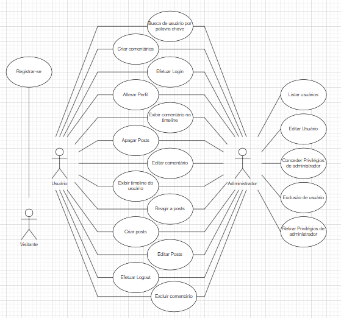

# Documento de Casos de Uso

## Lista dos Casos de Uso (notas: casos 18 precisam ser terminados)

 - [Registrar-se](#Registrar-se): Registrar no site.
 - [Efetuar Login](#Efetuar-Login): Entrar no site com a sua conta.
 - [Efetuar Logout](#Efetuar-Logout): Desvincular a sua conta ao site.
 - [Alterar Perfil](#Alterar-Perfil): Alterar os dados do seu perfil.
 - [Listar usuários (adm)](#Listar-usuários-(adm)): Acessar a lista de usuários de administrador.
 - [Editar usuário (adm)](#Editar-usuário-(adm)): Editar os dados de um usuário.
 - [Exclusão de usuário (adm)](#Exclusão-de-usuário-(adm)): Exclusão a conta de usuário.
 - [Conceder privilégios de adiministrador (adm)](#Conceder-privilégios-de-adiministrador-(adm)): Conceder privilégios de adiministrador a um usuário.
 - [Retirar privilégios de adiministrador (adm)](#Retirar-privilégios-de-adiministrador-(adm)): Retirar privilégios de adiministrador de um usuário.
 - [Busca de usuário por palavra chave](#Busca-de-usuário-por-palavra-chave): Buscar o nome de um usuário na barra de pesquisa.
 - [Criar Posts](#Criar-Posts): Criar posts na página principal do site.
 - [Editar Posts](#Editar-Posts): Editar posts feitos pelo usuário.
 - [Apagar Posts](#Apagar-Posts): Apagar posts feitos pelo usuário.
 - [Exibir timeline do Usuário](#Exibir-timeline-do-Usuário): Ver a linha do tempo de atividade de um usuário.
 - [Criar comentários](#Criar-comentários): Criar comentários em posts.
 - [Editar comentário](#Editar-comentário): Editar comentário feitos em posts.
 - [Excluir comentário](#Excluir-comentário): Excluir comentário feito pelo usuário.
 - [Exibir comentário na timeline](#Exibir-comentário-na-timeline): Exibir comentário na timeline do usuário.
 - [Reagir a posts/comentários](#Reagir-a-posts/comentários): Deixar uma reação positiva a um post ou comentário.

## Lista dos Atores

 - Visitante
 - Usuário
 - Adiministrador

## Diagrama de Casos de Uso

## Descrição dos Casos de Uso

### Registrar-se

Registrar no site.

**Fluxo Principal**

1. O sistema apresenta um formulário de cadastro com os campos onde o visitante deve preencher.
2. O visitante insere nome, email, senha e data de nascimento.
3. O visitante clica no botão “Cadastrar”.
4. O sistema armazena o usuário e o informa que a operação foi realizada.
5. O sistema retorna o usuário para a página de login.

**Fluxo Alternativo A**

1. O sistema apresenta um formulário de cadastro com os campos onde o usuário deve preencher.
2. O usuário insere nome, email, senha e data de nascimento.
3. O usuário clica no botão “Cadastrar”.
4. O sistema informa que já existe um usuário com o e-mail fornecido.
5. O usuário usa outro email na criação da conta.
6. O usuário clica no botão “Cadastrar”.
7. O sistema armazena o usuário e o informa que a operação foi realizada.
8. O sistema retorna o usuário para a página de login.

**Fluxo Alternativo B**

1. O sistema apresenta um formulário de cadastro com os campos onde o usuário deve preencher.
2. O usuário insere nome, email, senha e data de nascimento.
3. O usuário clica no botão “Cadastrar”.
4. O sistema informa que a data de nasciemento/nome/email é invalido.
5. O usuário corrige a data de nascimento/nome/email.
6. O usuário clica no botão “Cadastrar”.
7. O sistema armazena o usuário e o informa que a operação foi realizada.
8. O sistema retorna o usuário para a página de login.

### Efetuar Login

Entrar no site com a sua conta.

**Fluxo Principal**

1. O sistema apresenta um formulário de cadastro com os campos onde o usuário deve preencher.
2. O usuário clica no botão “Já tem uma conta?”.
3. O sistema leva o suário para uma página de login, que apresenta um formulário de com os campos onde o usuário deve preencher.
4. O usuário insere o email e a senha.
5. O usuário clica no botão “Entrar”.
6. O sistema reconhece uma conta com o mesmo email e senha e leva o usuário para a página principal.

**Fluxo Alternativo A**

1. O sistema apresenta um formulário de cadastro com os campos onde o usuário deve preencher.
2. O usuário clica no botão “Já tem uma conta?”. 
3. O sistema leva o suário para uma página de login, que apresenta um formulário de com os campos onde o usuário deve preencher.
4. O usuário insere o email e a senha.
5. O usuário clica no botão “Entrar”.
6. O sistema informa que o email/senha foi preechido incorretamente.
7. O usuário corrige o email/senha.
8. O usuário clica no botão “Entrar”.
9. O sistema reconhece uma conta com o mesmo email e senha e leva o usuário para a página principal.

### Efetuar Logout

Desvincular a sua conta ao site.

**Fluxo Principal**

1. O sistema apresenta a página principal.
2. O usuário decide desconectar a sua conta do site.
3. O usuário clica no botão “Sair”.
4. O sistema desconecta a conta do usuário e o leva para a página de login.

### Alterar Perfil

Alterar os dados do seu perfil.

**Fluxo Principal**

1. O sistema apresenta a página de perfil do usuário.
2. O usuário decide alterar suas informações pessoais.
3. O usuário clica no botão “Alterar Dados”.
4. O usuário insere a senha antiga e muda email/nome/senha.
5. O usuário clica no botão “Atualizar”.
6. O sistema altera as informações do usuário e o informa que a operação foi realizada.

**Fluxo Alternativo A**

1. O sistema apresenta a página de perfil do usuário.
2. O usuário decide alterar suas informações pessoais.
3. O usuário clica no botão “Alterar Dados”.
4. O usuário insere a senha antiga e muda email/nome/senha.
5. O usuário clica no botão “Atualizar”.
6. O sistema informa o usuário que o novo email/nome/senha é invalido.
7. O usuário corrige o email/nome/senha.
8. O usuário clica no botão “Atualizar”.
9. O sistema altera as informações do usuário e o informa que a operação foi realizada.

**Fluxo Alternativo B**

1. O sistema apresenta a página de perfil do usuário.
2. O usuário decide alterar suas informações pessoais.
3. O usuário clica no botão “Alterar Dados”.
4. O usuário insere a senha antiga e muda email/nome/senha.
5. O usuário clica no botão “Atualizar”.
6. O sistema informa o usuário que a senha antiga foi preenchida incorretamente.
7. O usuário preenche a senha antiga corretamente.
8. O usuário clica no botão “Atualizar”.
9. O sistema altera as informações do usuário e o informa que a operação foi realizada.

### Listar usuários (adm)

Acessar a lista de usuários de administrador.

**Fluxo Principal**

1. O sistema apresenta a página principal.
2. O adiministrador abre a janela de adiministração.
3. O sistema abre a jenela de adiministração.
4. O adiministrador têm na janela, acesso a uma lista contendo todos os dados de todos os usuários do site.

### Editar usuário (adm)

Editar os dados de um usuário.

**Fluxo Principal**

1. O sistema apresenta a página principal.
2. O adiministrador abre o Dashboard de adiministração.
3. O adiministrador escolhe um usuário na lista para ter a sua conta alterada.
4. O adiministrador clica no botão “Editar” ao lado do usuário escolhido.
5. O adiministrador altera os campos que necessitam de alteração.
6. O adiministrador clica no botão “Atualizar”
7. O sistema altera as informações do usuário escolhido.

### Exclusão de usuário (adm)

Exclusão a conta de usuário.

**Fluxo Principal**

1. O sistema apresenta a página principal.
2. O adiministrador abre a janela de adiministração.
3. O sistema abre a janela de adiministração contendo a lista de todos os usuários do site.
4. O adiministrador escolhe um usuário na lista para ter a sua conta excluida.
5. O adiministrador clica no usuário e no botão “Deletar” ao lado do usuário escolhido.
6. O sistema apaga o cadastro do usuário escolhido.

### Conceder privilégios de adiministrador (adm)

Conceder privilégios de adiministrador a um usuário.

**Fluxo Principal**

1. O sistema apresenta a página principal.
2. O adiministrador abre a janela de adiministração.
3. O sistema abre a janela de adiministração contendo a lista de todos os usuários do site.
4. O adiministrador decide conceder privilégios de adiministrador a um usuário.
5. O adiministrador clica no botão “Editar” ao lado do usuário escolhido.
6. O adiministrador concede privlégios de adiministrador ao usuário.
7. O sistema aplica os privilégios de adiministrador ao usuário escolhido.

### Retirar privilégios de adiministrador (adm)

Retirar privilégios de adiministrador de um usuário.

**Fluxo Principal** 

1. O sistema apresenta a página principal.
2. O adiministrador abre a janela de adiministração.
3. O sistema abre a janela de adiministração contendo a lista de todos os usuários do site.
4. O adiministrador decide retirar privilégios de adiministrador a um usuário.
5. O adiministrador clica no botão “Editar” ao lado do usuário escolhido.
6. O adiministrador retira os privlégios de adiministrador do usuário.
7. O sistema remove os privilégios de adiministrador do usuário escolhido.

### Busca de usuário por palavra chave

Buscar o nome de um usuário na barra de pesquisa.

**Fluxo Principal**

1. O sistema apresenta a página principal.
2. O usuário clica na barra de pesquisa e escreve um nome.
2. O usuário clica no botão “Buscar Usuário”.
3. O sistema apresenta uma lista de usuários com nomes similares ao digitado.

**Fluxo Alternativo A**

1. O sistema apresenta a página principal.
2. O usuário clica na barra de pesquisa e escreve um nome.
2. O usuário clica no botão “Buscar Usuário”.
3. O sistema apresenta uma mensagem dizendo que não ah nenhum usuário similar ao nome digitado.
4. O usuário escreve outro nome na barra de pesquisa.
5. O usuário clica no botão “Buscar Usuário”.
6. O sistema apresenta uma lista de usuários com nomes similares ao digitado.

### Criar Posts

Criar posts na página principal do site.

**Fluxo Principal**

1. O sistema apresenta a página principal.
2. O usuário clica no botão “Criar um post”.
3. O usuário escreve um título e uma mensagem que ele deseja passar.
4. O usuário clica no botão “Enviar”.
5. O sistema armazena a mensagem e a exibe na página principal.

**Fluxo Alternativo A**

1. O sistema apresenta a página principal.
2. O usuário clica no botão “Criar um post”.
3. O usuário decide que não deseja mais criar um post.
4. O usuário clica no botão “Fechar”.
5. O sistema fecha a janela de criação de post.

### Editar Posts

Editar posts feitos pelo usuário.

**Fluxo Principal**

1. O sistema apresenta um post feito pelo usuário na página principal.
2. O usuário clica no botão “Editar post”.
3. O usuário altera o título e/ou a mensagem antiga.
4. O usuário clica no botão “Atualizar”.
5. O sistema armazena a nova mensagem e a exibe na página principal.

### Apagar Posts

Apagar posts feitos pelo usuário.

**Fluxo Principal**

1. O sistema apresenta a página principal.
2. O usuário entra na timeline do seu perfil.
3. O usuário escolhe o post que ele deseja apagar.
4. O usuário clica no botão “Deletar”.
5. O sistema remove o post da página principal.

### Exibir timeline do Usuário

Ver a linha do tempo de atividade de um usuário.

**Fluxo Principal**

1. O sistema apresenta a página principal.
2. O usuário entra na timeline do seu perfil.
3. O usuário tem acesso a todos os seus posts e comentários.

### Criar comentários

Criar comentários em posts.

**Fluxo Principal**

1. O sistema apresenta um post na página principal.
2. O usuário clica na text box abaixo do post e escreve uma mensagem.
3. O usuário clica no botão “Comentar”.
4. O sistema armazena a mensagem e a exibe abaixo do post.

### Editar comentário

Editar comentário feitos em posts.

**Fluxo Principal**

1. O sistema apresenta um post com um comentário feito pelo usuário na página principal.
2. O usuário clica no botão “Editar” ao lado de seu comentário.
3. O usuário altera a mensagem do comentário.
4. O usuário clica no botão “Atualizar”
5. O sistema armazena a nova mensagem e a exibe abaixo do post.

### Excluir comentário

Excluir comentário feito pelo usuário.

**Fluxo Principal**

1. O sistema apresenta um post com um comentário feito pelo usuário na página principal.
2. 3. O usuário deicde apagar o seu comentário.
3. O usuário clica no botão “Deletar” ao lado de seu comentário.
4. O sistema exclui o comentário do post.

### Exibir Comentário na timeline

Exibir comentário na timeline do usuário.

**Fluxo Principal**

1. O sistema apresenta a página principal.
2. O usuário entra na timeline do seu perfil.
3. O usuário tem acesso a todos os seus posts e comentários.

### Reagir a posts/comentários

Deixar uma reação positiva a um post ou comentário.

**Fluxo Principal**

1. O sistema apresenta um post na página principal.
2. O usuário decide adicionar uma reação ao post ou a um comentário.
3. O usuário clica no botão “like”.
4. O sistema armazena o input e exibe abaixo do post a quantidade de likes presentes no post/comentário.

**Fluxo Alternativo A**

1. O sistema apresenta um post na página principal.
2. O usuário decide adicionar uma reação ao post ou a um comentário.
3. O usuário clica no botão “like”.
4. O sistema armazena o input e exibe abaixo do post a quantidade de likes presentes no post/comentário.
5. O usuário muda de idea e dicide remover a sua reação ao post/comentário.
6. O usuário clica no botão “like”.
7. O sistema armazena o input e exibe abaixo do post a quantidade de likes presentes no post/comentário.
