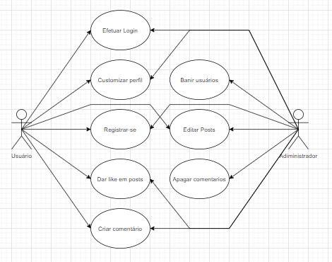

# Documento de Casos de Uso

## Lista dos Casos de Uso

 - [CDU 01](#CDU-01): Cadastro de Usuário.
 - [CDU 02](#CDU-02): Login de Usuário.
 - [CDU 03](#CDU-03): PLACEHOLDER.

## Lista dos Atores

 - Usuário
 - Adiministrador

## Diagrama de Casos de Uso

## Descrição dos Casos de Uso

### CDU 01

Cadastro de usuário

**Fluxo Principal**

1. O sistema apresenta um formulário de cadastro com os campos onde o usuário deve preencher.
2. O usuário insere nick, email, senha e data de nascimento.
3. O usuário clica no botão “cadastrar”.
4. O sistema armazena o usuário e o informa que a operação foi realizada.
5. O sistema retorna o usuário para a página de login.

**Fluxo Alternativo A**

1. O sistema apresenta um formulário de cadastro com os campos onde o usuário deve preencher.
2. O usuário insere nick, email, senha e data de nascimento.
3. O usuário clica no botão “cadastrar”.
4. O sistema informa que já existe um usuário com o e-mail fornecido.
5. O usuário usa outro email na criação da conta.
6. O usuário clica no botão “cadastrar”.
7. O sistema armazena o usuário e o informa que a operação foi realizada.
8. O sistema retorna o usuário para a página de login.

**Fluxo Alternativo B**

1. O sistema apresenta um formulário de cadastro com os campos onde o usuário deve preencher.
2. O usuário insere nick, email, senha e data de nascimento.
3. O usuário clica no botão “cadastrar”.
4. O sistema informa que a data de nasciemento/nome/email é invalido.
5. O usuário corrige a data de nascimento/nome/email.
6. O usuário clica no botão “cadastrar”.
7. O sistema armazena o usuário e o informa que a operação foi realizada.
8. O sistema retorna o usuário para a página de login.

### CDU 02

Login de Usuário.

**Fluxo Principal**

1. O sistema apresenta um formulário de login com os campos onde o usuário deve preencher.
2. O usuário insere o email e a senha.
3. O usuário clica no botão “entrar”.
4. O sistema reconhece uma conta com o mesmo email e senha e leva o usuário para a página principal.

**Fluxo Alternativo A**

1. O sistema apresenta um formulário de login com os campos onde o usuário deve preencher.
2. O usuário insere o email e a senha.
3. O usuário clica no botão “entrar”.
4. O sistema informa que o email/senha foi preechido incorretamente.
5. O usuário corrige o email/senha.
6. O usuário clica no botão “entrar”.
7. O sistema reconhece uma conta com o mesmo email e senha e leva o usuário para a página principal.

### CDU 03

PLACEHOLDER.

**Fluxo Principal**

1. Praesent interdum lectus sit amet augue tincidunt imperdiet.
2. Duis ac dolor vel nisi imperdiet vehicula et non sem.
3. Nunc imperdiet tortor consequat, lobortis purus non, interdum risus.

**Fluxo Alternativo A**

1. Aliquam efficitur arcu ac fermentum egestas.
2. Pellentesque ac diam vitae erat bibendum hendrerit.
3. Mauris sed purus sit amet lectus efficitur placerat et eu diam.
4. Aenean ullamcorper tellus quis nibh porttitor congue.
5. Phasellus laoreet erat eget condimentum dictum.
