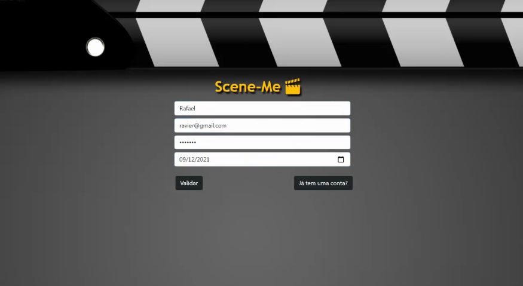
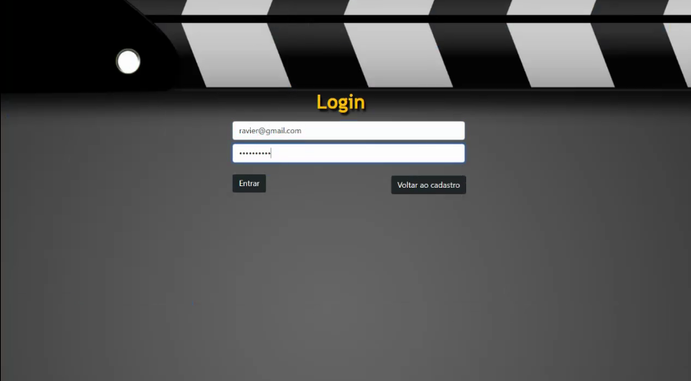
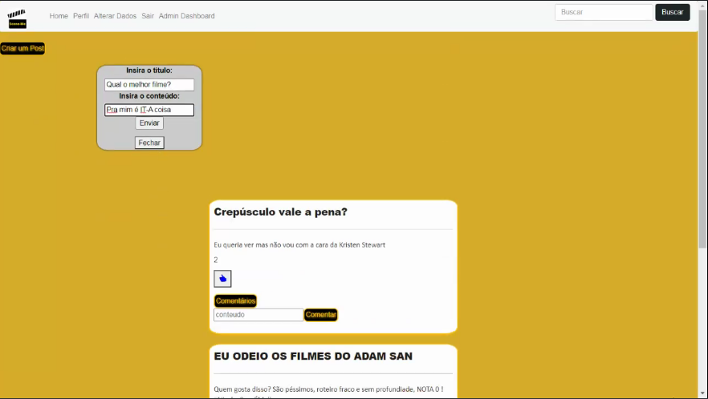
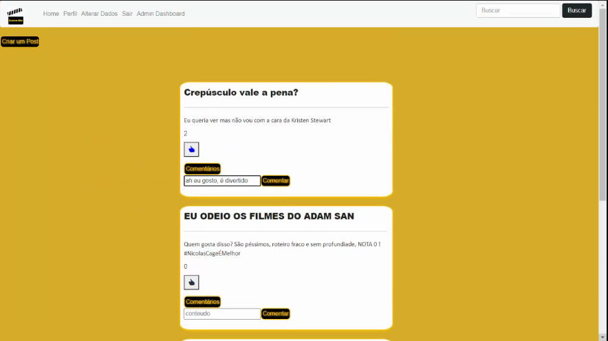
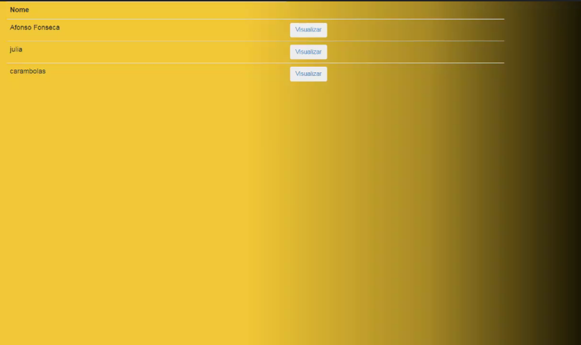
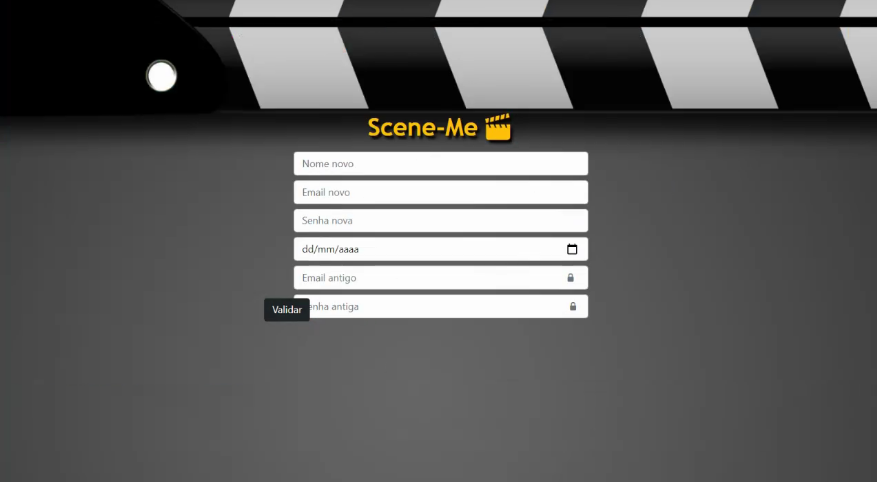
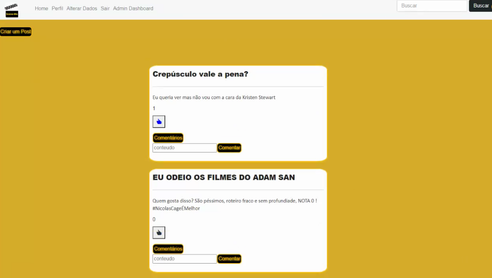
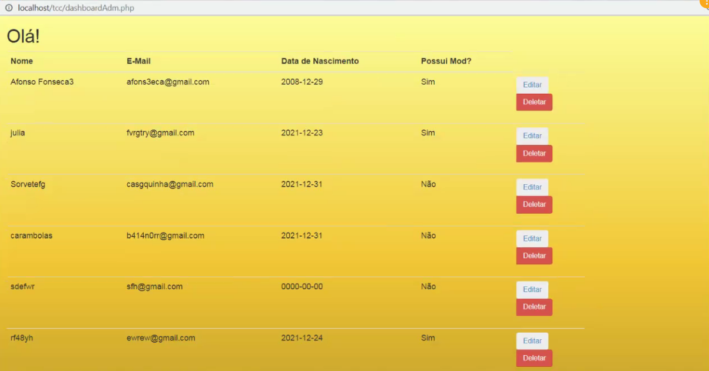

# Manual do Usuário

Esse é o manual de usuário do site SceneMe, aqui nós fizemos o possivel para esclarecer o máximo possivel as funções do nosso site para os novos usuários
que irão usa-lo.

**Lista das Funcionalidades:**

 - [Funcionalidade de Cadastro](#Funcionalidade-de-Cadastro)
 - [Funcionalidade de Login](#Funcionalidade-de-Login)
 - [Funcionalidade de Post](#Funcionalidade-de-Post)
 - [Funcionalidade de Busca](#Funcionalidade-de-Busca)
 - [Funcionalidade de Perfil](#Funcionalidade-de-Perfil)

**Lista das Funcionalidades de adiministrador:**

- [Funcionalidade de Dashboard](#Funcionalidade-de-Dashboard)
- [Funcionalidade de atualização de Usuário](#Funcionalidade-de-atualização-de-Usuário)

## Funcionalidade de Cadastro

O visitante deve criar uma conta antes de poder entrar no site, para isso ele deve criar uma conta, inserindo um email, sua data de nascimento e uma senha, 
e clicar no botão Cadastrar para terminar o processo como na imagem a cima

É importante que o usuário lembre das informações de sua conta, porque somente usando os dados dela eles poderão fazer login no site
e usar as suas funções.

## Funcionalidade de Login

O usuário que já possui uma conta pode fazer login no site e ter acesso a todas as suãs funções, ele deve clicar no botão “Já tem uma conta?”, que
o leva para uma página onde ele deve preencher o seu email e senha como na imagem a cima. Logo depois clique no botão “Entrar” e 
você tera entrado no site com a sua conta com sucesso.

O usuário pode a qualquer momento trocar de perfil usando o botão “Sair”, levando o para a página de login para se conectar a outra conta.

## Funcionalidade de Post

O usuário pode criar posts, compartilhando com as outras pessoas os diversos assuntos que o veem a mente, seja uma critica, uma descrição, uma análise
etc. O importante é que esses posts são colocados na página principal doo site, onde os outros usuários poderam compartilhar as suas opniões e avaliar
os posts de outros usuários. Para criar um post, o usuário deve clicar no botão “Criar um post” e escrever a mensagem que ele deseja passar e um título apropiado como na 
imagem a cima, logo depois ele clica no botão “Enviar” e seu post está publicado para todos verem.

Agora que você criou um post, você e outros usuários podem deixar comentários nele, simplesmente escreva a mensagem na text box abaixo do post e clique no
botão “Comentar”, você tambem pode clicar no botão de like para deixar uma avaliação positiva como na imagem a cima. A qualquer momento você pode 
editar ou apagar os seus posts e comentários, somente clicando no botão apropiado: “Editar” ou “Deletar”, editando você vai poder trocar a mensagem,
e no caso do post, o título tambem.

## Funcionalidade de Busca

Na parte superior direita da tela principal os usuários podem usar a barra de pesquisa para pesquisar por outro usuários que utilizam o site, basta
escrever o nome ou preencher letras que estão presentes no nome e clicar em “Buscar Usuário” como na imagem a cima. O resultado será todos os usuários 
do site que tem um nome com as letras que você preencheu.

## Funcionalidade de Perfil

Na parte superior esquerda do header do site, você encontra as duas opções do seu perfil “Perfil” e “Alterar Dados”, a opção de Perfil te leva a sua
timeline, onde você pode ver os posts que você fez nop site, como pode ver no exemplo a cima.

E alterando os dados você pode mudar os detalhes de sua conta, como email e senha por exemplo, altere os dados e clique no botão “Atualizar” como no
exemplo a cima.

## Funcionalidade de Dashboard

O trabalho de um adiministrador é moderar as atividades dos usuários e reforçar as regras do site. Para os adiministradores fazerem as suas
tarefas, eles usam a ferramenta Adimin dashboard do site. Para a acessar é preciso clicar no botão “Admin dashboard” como na imagem a cima.

Nessa página o adiministrador tem fácil acesso a todos os usuários, agilizando o seu trabalho de moderação.

## Funcionalidade de atualização de Usuário

Se um usuário fizer algum post ou comentário que quebre as regras do site, ou precisar de alterações em suas contas é o trabalho do adiministrador 
resolver o problema de forma adequada.

Os adiminstradores podem alterar ou excluir os perfis de usuários como demonstrado na imagem a cima.
